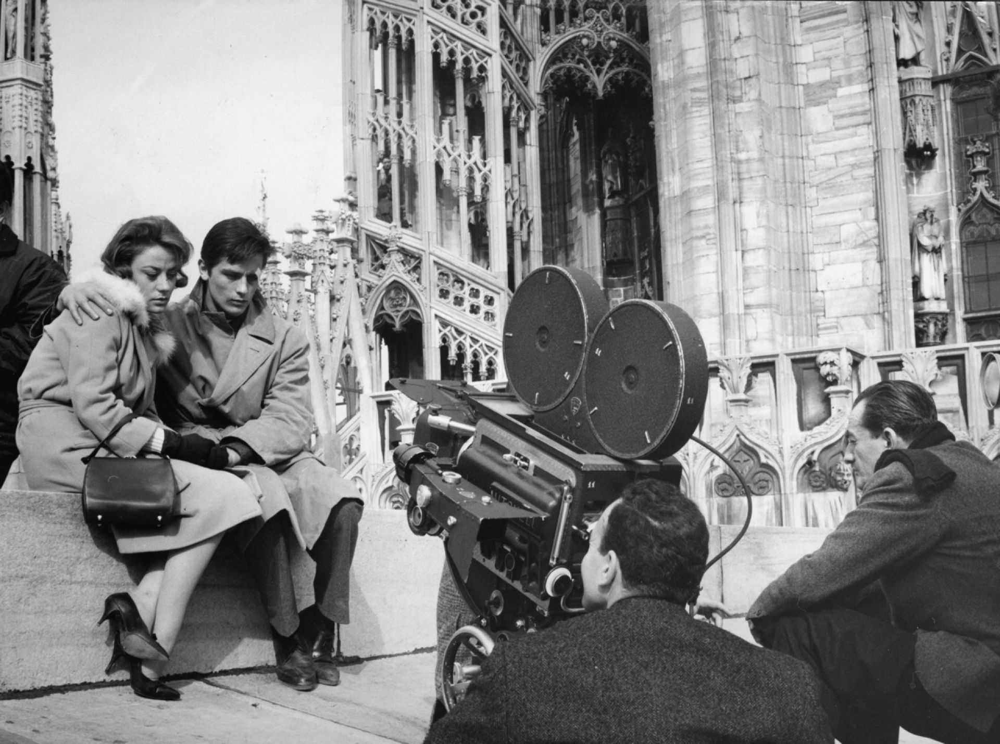
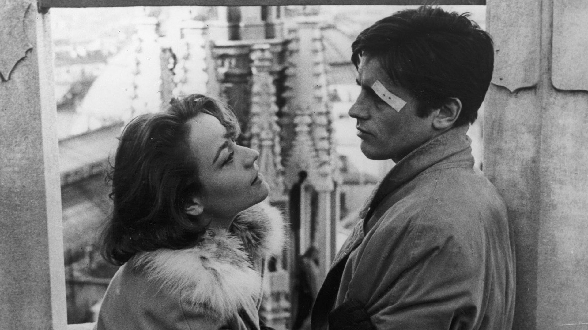

+++ 
date = "2026-06-06T12:00:00+02:00" 
draft = false 
title = "La palestra Visconti" 
+++

I had never watched _Rocco and His Brothers_. I had to split it into three parts to get through it during the week. Of course, as soon as I finished it, I began my usual deep dive on the web, trying to understand what had happened and to put my emotional experience of the film in order.

I discovered that the Visconti gym is just a stone’s throw from where I live. I got emotional. I wanted to run there immediately to see it. 

Simone is trash, Ciro is selfish. The mother is the source of all evil. Rocco should have lost the ability to speak after the encounter with Nadia at the bar, just like Zaccaria did. In that case, I would have given the film a 10.

And yet, what lightness, what elegance. A few seconds of film are enough to make us float along with the spontaneous innocence of almost all the characters. Seeing hope being born in Nadia’s eyes, and then that tiny tear, was worth the whole film.

If that cursed Rocco had had the courage to confront his brother earlier, before being discovered in the woods, maybe the stabbing could have been avoided, and they would not have stolen each other’s destiny.

If only Simone had remembered the things he said to Ciro before becoming a drunkard, maybe he would not have become a monster, but would have remained only a coward.

And what can be said about Vincenzo? Nothing, really. A fairly useless character.

rating : 9,5/10