+++
title = "Che cosa si costruisce con 2,50 euro di AI?"
date = "2026-07-25T09:30:00+02:00"
lastmod = "2026-08-10T16:30:00+02:00"
draft = false
description = "Un esperimento a budget minimo: landing page, flusso ordini e tre video per promuovere una console retro."
tags = ["Kimi K3", "AI coding", "retro gaming", "video generativo"]
categories = ["Esperimenti"]
images = ["landing-finale.png"]

[cover]
image = "landing-finale.png"
alt = "Landing page RetroX con una console portatile bianca"
caption = "La landing page al termine dell'esperimento."
relative = true
+++

Quanto si riesce a costruire con pochi euro di credito per modelli AI? Ho provato a realizzare una piccola campagna per una console portatile da retrogaming: landing page, flusso ordini e video promozionali. Il limite non era soltanto economico. Volevo capire quali parti un modello potesse produrre bene in autonomia e dove fosse ancora necessario intervenire.

Il risultato finale è costato circa due dollari di API, oltre ai crediti gratuiti inclusi nelle prove dei servizi video. Quel denaro non ha comprato un progetto finito: ha comprato soprattutto il primo tentativo e una lezione su come ridurre il contesto.

## Il primo prompt era troppo grande

La richiesta iniziale chiedeva a Kimi K3 un progetto React completo: design, animazioni, galleria, specifiche, recensioni, checkout, FAQ, accessibilità e metadata. Era un brief sensato per un team, ma troppo ampio per il budget disponibile in una singola risposta.

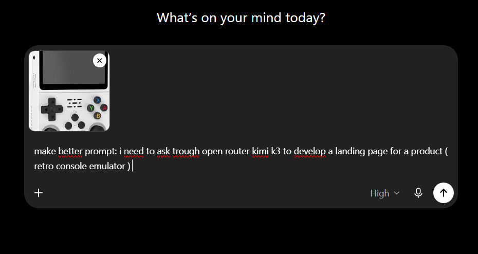

La versione ridotta conservava soltanto ciò che serviva a impostare la pagina:

```text
Create a modern, responsive landing page for a portable retro gaming console.
Use the product image in the hero section.

Include navigation, hero, features, supported systems, gallery,
technical specifications, purchase section, FAQ and footer.

Use React, Vite, TypeScript, Tailwind CSS, Lucide icons and Framer Motion.
Make the project responsive, accessible and easy to edit.
Do not imply that copyrighted ROMs are included.
```

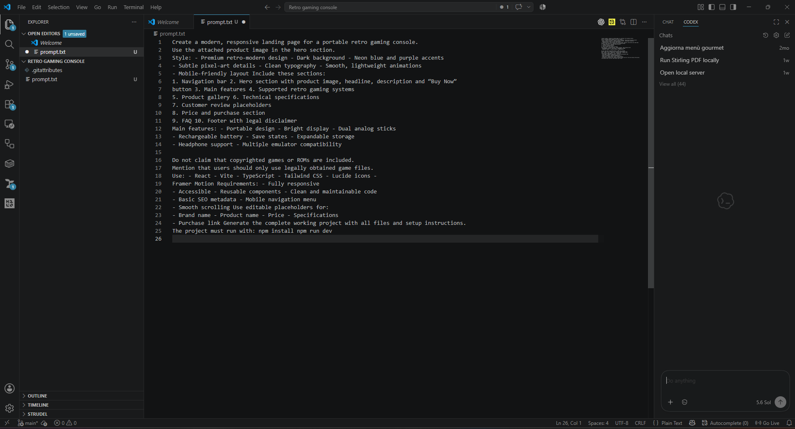

Anche così, la risposta si è fermata dopo circa 2.600 token di output e ha consumato quasi tutto il credito impostato. Il problema non era che il modello non sapesse scrivere il codice; il risultato non poteva contenere, in così poco spazio, un'intera applicazione rifinita.

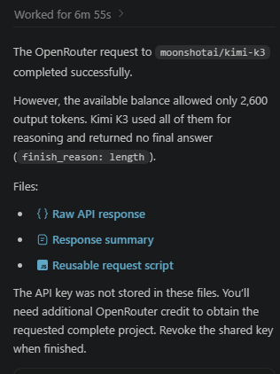

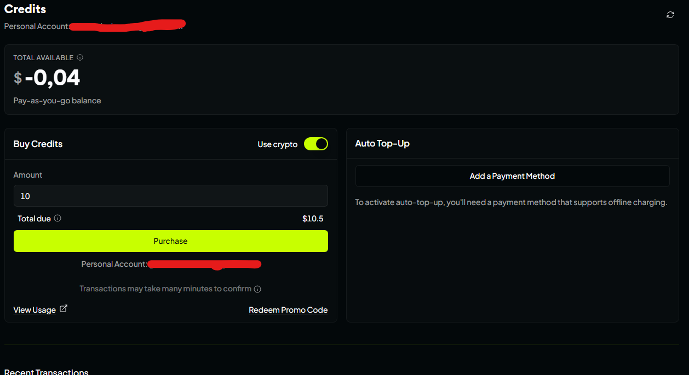

## Cambiare strategia

Invece di chiedere nuovamente il progetto completo, ho separato il lavoro:

1. generare una prima pagina HTML più piccola;
2. importarla nell'ambiente di sviluppo;
3. correggere struttura, componenti e layout con un secondo assistente;
4. verificare manualmente mobile, testi e flusso di acquisto.

Il primo output utile valeva circa 0,20 dollari di token. Era semplice, ma conteneva abbastanza materiale per smettere di lavorare su una pagina vuota. Da lì è stato più economico formulare richieste locali e precise: correggere una sovrapposizione, ridurre una sezione, sistemare la navigazione mobile.

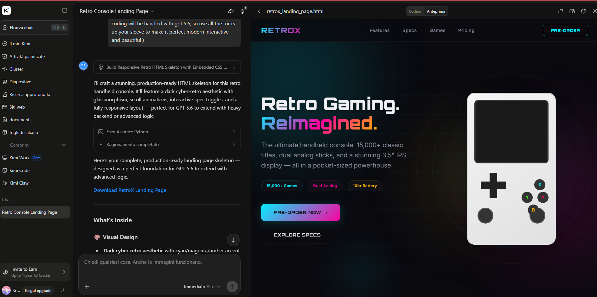

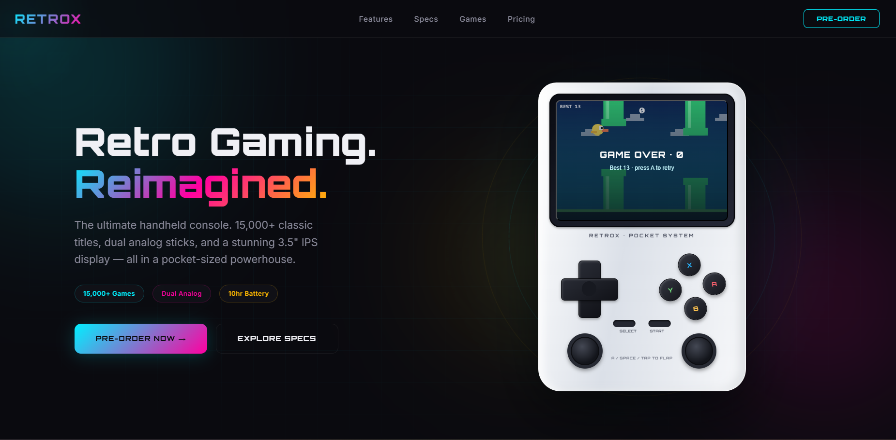

La lezione è stata netta: con un budget piccolo, **un prompt non deve descrivere l'intero sogno; deve produrre il prossimo artefatto verificabile**.

## Dal prototipo agli ordini

Una landing page gradevole non basta. Ho aggiunto un piccolo flusso che invia gli ordini a un bot Telegram con le informazioni necessarie per elaborarli. È una soluzione adatta a un esperimento con pochi ordini, non un sostituto universale di un backend e-commerce: pagamenti, dati personali, conferme e gestione degli errori richiedono controlli dedicati.

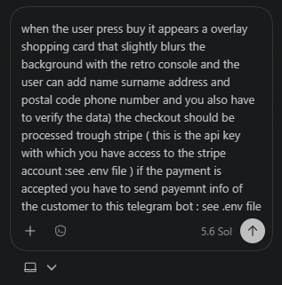

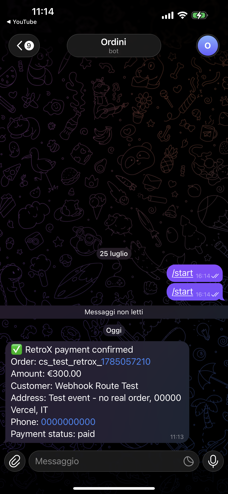

Prima di considerare pronta la pagina ho dovuto intervenire sui problemi che il modello non vedeva nel suo output testuale:

- elementi sovrapposti sugli schermi piccoli;
- gerarchia visiva poco chiara;
- specifiche del prodotto da verificare;
- pulsanti e collegamenti senza uno stato d'errore;
- messaggi commerciali troppo generici.

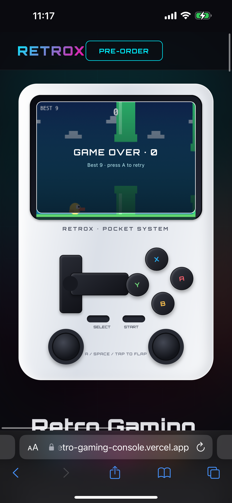

Questa fase ha richiesto meno token e più giudizio. Il codice generato era un materiale di partenza, non una decisione definitiva.

## Il prompt per il video

Per lo spot ho usato un prompt più controllato, concentrato su un'unica inquadratura e sulla fedeltà del prodotto:

```text
Animate this white retro handheld console as a clean product commercial.
Keep its shape, controls, colors and proportions unchanged.
Use a slow camera push-in, a subtle orbit, realistic screen reflections
and soft studio shadows. Five seconds, no hands and no extra objects.

Negative prompt: do not deform the console, alter the button layout,
add controls, distort the screen or change the background.
```

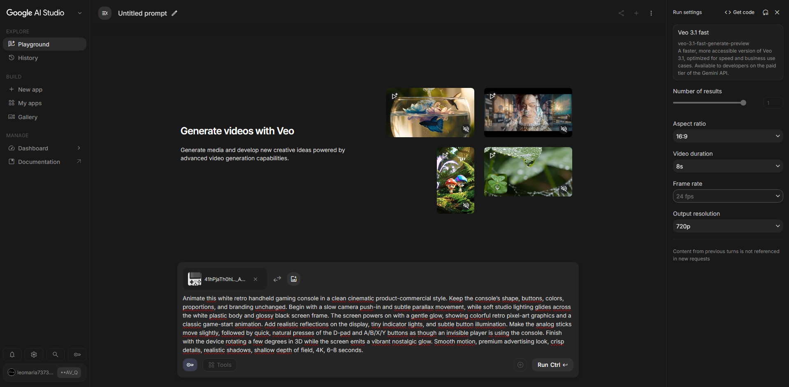

Dopo aver verificato che non avevo altri crediti nel primo servizio, sono passato a CapCut e ho usato il credito gratuito per più generazioni. Questo ha reso possibile confrontare varianti, invece di accettare il primo video soltanto perché era costato denaro.

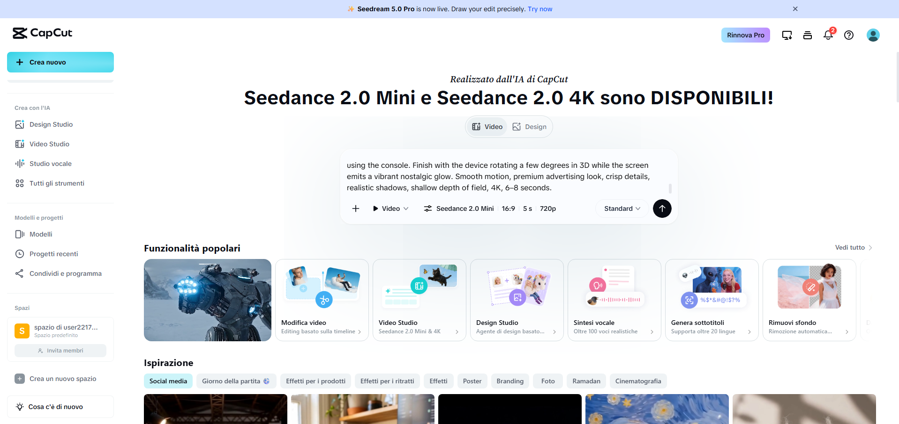

Per una delle varianti ho preparato anche un'immagine di riferimento più vicina all'estetica del canale. Il risultato era vistoso, ma utile per capire quanto una reference possa spostare tono e pubblico percepito della stessa campagna.


## Pubblicazione

Il mio canale contiene gameplay di giochi retro, quindi ho collegato la campagna a contenuti già coerenti con il pubblico. Ho prodotto tre prove video:

- [prima versione](https://youtu.be/AZoRdkSwNf8);
- [seconda versione](https://youtu.be/rqFyqHyuBBQ);
- [terza versione](https://youtu.be/fB7UoBMKwCA).

Il piano era usare uno Short per attirare l'attenzione e rimandare a un video correlato con il collegamento al prodotto nella descrizione. Non considero questa scelta una formula per l'algoritmo: è semplicemente un percorso misurabile da cui partire.

## Bilancio

Con circa due dollari e alcuni crediti di prova ho ottenuto una landing page funzionante, un flusso ordini essenziale e tre video. Il primo tentativo API ha assorbito quasi tutto il budget senza completare il progetto, ma ha chiarito il vincolo più importante.

Spendere poco non significa chiedere meno qualità. Significa dividere il lavoro in passaggi piccoli, controllare ogni output e riservare i token alle parti in cui accelerano davvero il progetto.
