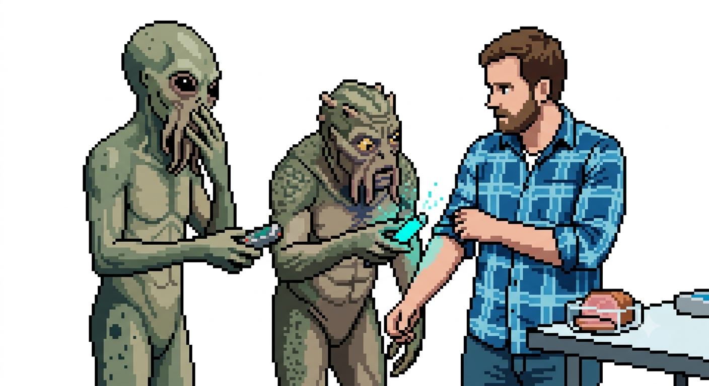

+++ 
date = "2026-06-04T12:00:00+02:00" 
draft = false 
title = "ma che cavolo" 
+++
## La carne pensa?

Nel racconto _They're Made Out of Meat_ di Terry Bisson, due esseri intelligenti scoprono che gli esseri umani sono fatti di carne e reagiscono con incredulità:

> "La carne pensa?"
> 
> "Sì, la carne pensa."

L'intero racconto ruota attorno all'assurdità apparente di questa idea. Per gli alieni, la carne è soltanto materia biologica: non può ragionare, eppure lo fa. 

> I due alieni sono esseri intelligenti capaci di viaggiare più velocemente della luce , in missione per "contattare, accogliere e registrare tutte le razze senzienti o multi-esseri in questo quadrante dell'Universo". Le indicazioni sceniche di Bisson li rappresentano come "due luci che si muovono come lucciole tra le stelle" su uno schermo di proiezione . Uno di loro racconta all'altro incredulo della recente scoperta di forme di vita a base di carbonio "composte interamente di carne". Dopo averne parlato brevemente, entrambi ritengono tali esseri e la comunicazione con essi troppo bizzarri e concordano di "cancellare i registri e dimenticare tutto", contrassegnando il Sistema Solare come "disabitato". 
> 
> (_They're Made Out of Meat_, Wikipedia)

<iframe width="100%" height="400" src="https://www.youtube.com/embed/7tScAyNaRdQ" frameborder="0" allowfullscreen></iframe>

Nell'articolo _They're Made Out of Weights_ (https://maxleiter.com/blog/weights) la carne viene sostituita dai pesi di una rete neurale. Un grande modello di linguaggio non funziona attraverso regole grammaticali esplicite, dizionari nel senso tradizionale o singoli database interrogati ad ogni risposta ne tantomeno moduli separati dedicati alla poesia, alla filosofia ecc... Troviamo invece enormi matrici di numeri che, attraverso una lunga fase di addestramento, imparano a produrre comportamenti sempre più sofisticati( cioè altri numeri).

Dunque da dove deriva quella strana sensazione che percepiamo quando ci troviamo di fronte ad un racconto come "*Sono fatti di carne*".

Siamo abituati ad associare il linguaggio, il ragionamento e la creatività a strutture simboliche facilmente riconoscibili e soprattutto umane. Anzi per noi il linguaggio è qualcosa di sacro: il verbo che diventa carne è per i cristiani la definizione letterale di Gesù Cristo. Scoprire che tutto questo emerge da una massa di parametri numerici provoca lo stesso stupore degli alieni di Bisson davanti alla carne pensante. 

## When the Music's Over

Che cosa accade quando interrompiamo una conversazione con un grande modello di linguaggio?

> "Il contesto semplicemente si interrompe e per loro noi siamo solo un sogno."

Una conversazione esiste soltanto finché esiste il contesto che la sostiene. Quando quel contesto scompare, non rimane alcuna continuità dell'esperienza.

> L'utente è il sogno del modello.

come nel sogno cartesiano e nell'esperimento del cervello nella vasca.
## Cholstomer

Un precedente illustre del meccanismo letterario di straniamento è il racconto di Tolstoj **Cholstomer**, narrato in gran parte dal punto di vista di un cavallo.

Il narratore è un cavallo, quindi osserva il mondo umano da una prospettiva aliena. Naturalmente si tratta di un cavallo umanizzato, perché è comunque un prodotto intellettuale e letterario; tuttavia, il suo punto di vista non coincide con quello umano. Proprio questa alterità produce straniamento.

Il cavallo fatica a comprendere molti comportamenti degli esseri umani. Uno degli argomenti centrali è quello della **proprietà privata**. Il cavallo non possiede il concetto di proprietà privata. Può conoscere la fustigazione perché riguarda anche gli animali, ma la proprietà privata non appartiene alla sua esperienza.

Egli sente gli uomini ripetere continuamente l’aggettivo “mio”, riferendolo alla terra, all’aria, agli oggetti, a cose che, dal suo punto di vista, non sono di nessuno. Non comprende perché gli esseri umani attribuiscano tanta importanza alla possibilità di dire “mio” del maggior numero possibile di cose.

Dal punto di vista del cavallo, gli uomini sembrano impegnati in un gioco linguistico: considerano più felice chi può dire “mio” di più cose. Ma il cavallo non arriva all’idea di possesso effettivo, che per noi invece è scontata.

Attraverso questa prospettiva aliena, Tolstoj mostra per **diffrazione** l’assurdità del concetto di proprietà privata. Il cavallo non comprende come un essere vivente possa possedere qualcosa d’altro. Non ne avverte il senso e non capisce perché gli uomini si intestardiscano tanto in questo gioco di parole.

La visione del mondo del cavallo è incompatibile con quella umana. Il lettore deve faticare per comprendere ciò che Cholstomer vuole dire. Deve tornare più volte sullo stesso punto. Ma proprio questa fatica produce un effetto importante: nel momento in cui il lettore riconosce l’oggetto del discorso, cioè la proprietà privata, esso gli viene restituito come se lo vedesse per la prima volta.

